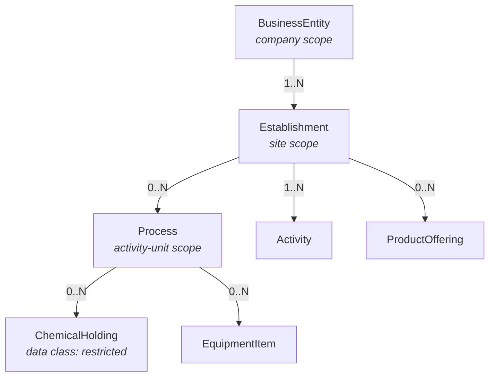

# Domain model

The canonical model is `spec/model/core.yaml` (LinkML). Everything in `spec/generated/`
— JSON Schema, SHACL, Postgres DDL, Pydantic, TypeScript, JSON-LD context, and the ER
diagram — is generated from it and diff-gated in CI. **This document explains the model;
it does not define it.** Where the two disagree, the model wins and this document is a
bug.

## The entity graph

Three scopes, and the distinction between them is load-bearing:

- **Business entity** carries company-wide headcount and receipts. Size-based exemptions
  count here.
- **Establishment** carries the jurisdiction path, site employment, and the
  classification most industry keying uses.
- **Process** exists because chemical-process regimes attach codes and quantity
  thresholds *below* the site, and explicitly forbid defaulting a process code from the
  facility's primary code.

A model with only the first two cannot express those regimes. A model with only the
second gets size-based exemptions wrong in both directions.

## The attribute registry

`spec/registry/attributes.yaml` is the contract between intake forms, rule predicates,
and model pre-fill. Each entry declares:

| Field | Purpose |
| --- | --- |
| `uri` | Stable identifier, prefixed by scope (`company.`, `establishment.`, `process.`) |
| `scope_unit` | The unit of analysis. **Checked against every predicate that uses it.** |
| `datatype` | |
| `collection_method` | intake form, geocode, derived, derived-confirmed, jurisdiction rule |
| `data_class` | `public`, `business_confidential`, or `restricted` |
| `llm_egress_allowed` | Whether the value may be sent to a third-party model provider |

A rule referencing an unregistered attribute fails linter **L-04**. A rule whose
predicate scope disagrees with the registry fails the same rule. This is the mechanism
that makes the two-keys-two-scopes bug unwriteable rather than merely documented.

Chemical inventory attributes are `restricted` with `llm_egress_allowed: false`. They
are security-sensitive, and no model or analytics endpoint sees them.

Beyond the typed attributes needed by implemented regimes, an open `Fact` table carries
the long tail — subject, attribute, typed value, unit, effective range, source,
confidence — without schema churn per regime.

## Classification identity

`Concept` has a synthetic primary key for foreign-key convenience and a **natural key of
`(scheme_version, code)`**, declared as a `unique_key` in the model. There is no
representation of a bare code anywhere.

`Correspondence` and `ConceptMapping` make crosswalks addressable and versioned rather
than a lookup table. `CodeTranslation` retains the **hop path** and the chain of match
types, and sets `is_composable` true only when every hop is an exact match — close-match
chains never auto-compose, and a translation that needed one is flagged for review.

`ClassificationAssignment` carries `confirmation_state` and `is_code_of_record`.

> **The constraint that makes ADR-0005 real:** a `Determination` may only reference a
> `ClassificationAssignment` whose `confirmation_state` is not `unconfirmed`. This is to
> be a database `CHECK`, not an application invariant, so that code trying to bypass it
> fails at the storage layer. It is **specified today and not yet enforced** — there is no
> database yet. It lands with the first migration.

## Roll-up as data

`RollupRule` is a table — target scope, source scope, method, authority citation,
optional regime, and a `no_default_from_parent` flag.

This matters because different regimes demand different roll-ups, and one of them
demands *none*: a statistical programme may cascade an enterprise code by largest
payroll share, while a chemical-safety programme explicitly forbids defaulting a process
code from the facility's primary code. Encoding roll-up as rows makes the prohibition
expressible. Encoding it in application logic makes it an exception somebody removes
during a refactor.

## Regulatory side

`Jurisdiction` is a reified node with a parent hierarchy and effective dates.
`JurisdictionProfile` carries an inclusion list **and** an exception list, because
"everywhere except one state" is a common pattern a flat column cannot represent.

`LegalSource` is a retrieved, hashed, point-in-time snapshot with a `source_url`,
`retrieved_at`, `as_of_date`, and `text_hash`. Every obligation references one.

`Determination` persists `rule_version_id`, `engine_version`, `as_of_law`, and
`input_snapshot_hash`, plus the stored evidence tree and `missing_attributes[]`.

## Credential side

A CTDL application profile — see ADR-0012 for what is adopted, extended, and refused.

`Requirement` is **reified**: a table between a credential and what it demands, carrying
jurisdiction profile, residency, minimum age, experience, cost, and effective dates. It
is recursive via `parent`, with `node_type` in `{AND_GROUP, OR_GROUP, LEAF}`.

That recursion is not theoretical. A real certification path reads: *four years of
supervised experience, OR completion of an approved programme plus two years — and in
either case, pass the examination.* That is an AND group containing an OR group
containing two leaves, plus a sibling leaf. A flat foreign key cannot express it, and
neither can a single boolean column.

A requirement leaf targets one of: another credential, an assessment, an evidence
artifact, or **a predicate from the rules DSL**. That last option is the seam that
unifies the regulatory and credential halves of the system into a single evaluator.

`CredentialDependencyEdge` is the derived, typed edge used for topological ordering.
Cycles are a transcription error in the source law and fail CI — see
`scripts/check-rules.py`.
