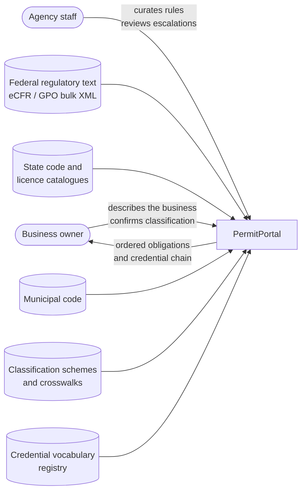
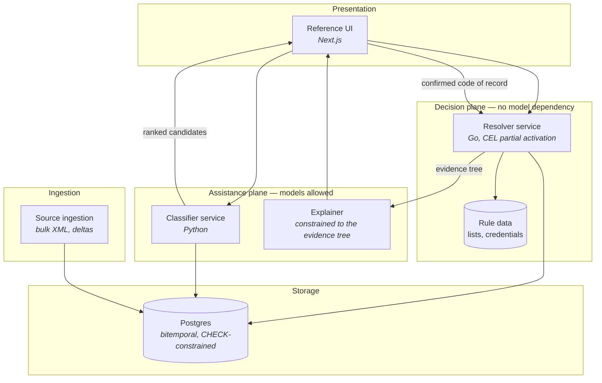
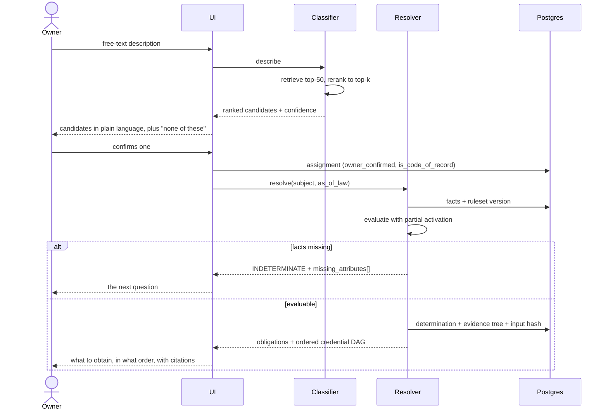

# Architecture

C4 levels 1 and 2. Mermaid has no C4 model, so the discipline is convention (ADR-0016):
one diagram per level, a fixed legend, no diagram over twelve nodes.

## Level 1 — context

PermitPortal reads authoritative public sources and writes nothing back to them. It files
nothing on anyone's behalf (`01-vision-and-problem.md`, non-goals).

## Level 2 — containers

The vertical split is the architecture. Everything in the **assistance plane** may call
a model. Nothing in the **decision plane** may — `packages/rules/engine` declares zero
model-client dependencies, and `scripts/check-engine-purity.py` fails the build on any
model-client import or manifest dependency there (ADR-0001).

Note the direction of the arrows between the planes. The classifier hands candidates to
the UI, not to the resolver. The resolver receives only a **confirmed** code of record.
The explainer receives an already-computed evidence tree and may only render nodes
present in it. There is no path by which a model output reaches a determination.

## Determination sequence

The loop back through "the next question" is the product. A system that cannot say *what
it still needs to know* has to guess, and guessing here is how a business gets fined.

## Domain model diagram

Generated from the canonical model rather than drawn:
[`spec/generated/core.er.mmd`](../spec/generated/core.er.mmd). It is regenerated by
`./do spec` and diff-gated, so it cannot drift from the schema it depicts.

## What is deliberately absent

- **No level 4.** There is no application code yet, and a component diagram of code that
  does not exist is a claim this repository's status discipline forbids.
- **No graph database.** ADR-0011.
- **No message bus.** Determination is synchronous and sub-second by design; ingestion is
  a scheduled batch. Adding a bus before there is a queueing problem buys an operational
  surface in exchange for nothing measurable.
